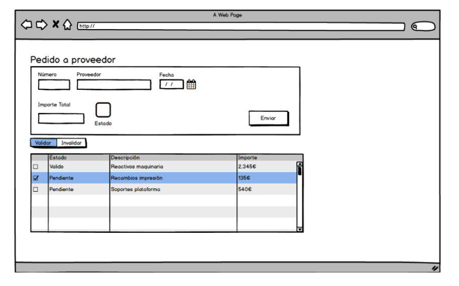

## Aplicación de gestión de pedidos React

### Enunciado

La idea es manejar un modelo con una estructura con algo de complejidad que al presentarlo en el navegador se tenga que decidir y plantear las mejores alternativas para dividir en componentes y la comunicación entre los mismos.

El modelo planteado es el de un Pedido (usuarios avanzados pueden también gestionar la lista de pedidos).

Las reglas son sencillas:

- El pedido tiene una cabecera con información general sobre el pedido como el número, la fecha y el cliente. ✅

- Cada pedido tiene una serie de líneas de pedidos con el artículo que se va a solicitar y el importe del mismo. ✅

- Al modificar el importe de alguna línea de pedido el importe total del pedido se actualiza. ✅

- Cada línea de pedido podrá ser validada o invalidada (volver al estado pendiente). ✅

- El pedido solo podrá ser enviado si todas las líneas del pedido están validadas. ✅

- El estado del pedido indica el porcentaje de líneas que están validadas, por ejemplo un pedido que tiene la mitad de sus líneas validadas estará al 50%. ✅

Resumiendo:

- Importe total es un campo calculado. ✅

- Estado depende de si todas las líneas han sido validadas. ✅

- En la tabla tengo un checkbox de selección múltiple para validar/invalidar las líneas seleccionadas. ✅

- El campo importe es de edición. ✅

- El botón de enviar solo se habilita si el estado es 100% (todas las líneas validadas). ✅

Un mock de como sería la ventana:

### Pistas

Plantéate arrancar por:

- Un contenedor que tenga la información del pedido completo.

- Un componente cabecera:

    - Le pasamos por propiedad:

        - Los datos de cabecera (una entidad número, proveedor, fecha).

        - El importe total y el estado.

        - Un callback para enviar.

    - El cálculo si enviar está deshabilitado o no, podemos decidir si dejarlo en el componente o subirlo al contenedor.

- Un componente detalle del pedido:

    - Le pasamos por propiedad:

        - El listado de detalle del pedido.

        - Callback para actualizar un array de entradas (validar/invalidar)

        - Callback para actualizar una cantidad monetaria (id/valor)

    - Aquí podemos evaluar si el listado de items seleccionados lo tenemos en el container, o si lo encapsulamos en el detalle (si lo subimos al container, lo que es el callback validar/invalidar no le harían falta parámetros para informar, el padre ya tiene la información).

    - Para hacer la edición empieza fácil, un map y tira cada fila, también puedes usar una tabla de Material UI.

Con qué podemos jugar adicionalmente:

- Podrías tener un contexto que wrapeara a esta ventana y no tener que pasar cabecera y detalle para abajo directamente tirar del contexto.

- Podrías romper el componente de cabecera en dos hijos:

    - Una con la info pura de cabecera (a esta le puedes aplicar React.Memo y evitar que se repinte, no es necesario para este caso pero es útil para prácticar).

    - Otro con el botón de enviar el pedido y el total sumarizado.

- También puedes probar a resolver el ejercicio utilizando useReducer:

    - En el contenedor tendrías el reducer, pasarías el estado para abajo, también el dispatch.

    - Vas actualizando toda la info que falta en el reducer.

##  Instrucciones
| Instrucción               |                                                                         |
| :------------------------ | :---------------------------------------------------------------------- |
| `npm install`             | Instala las dependencias                                                |
| `npm run dev`             | Inicia el servidor de desarrollo en `http://localhost:5173/`            |
| `npm run build`           | Construye el proyecto en el directorio dist                             |    